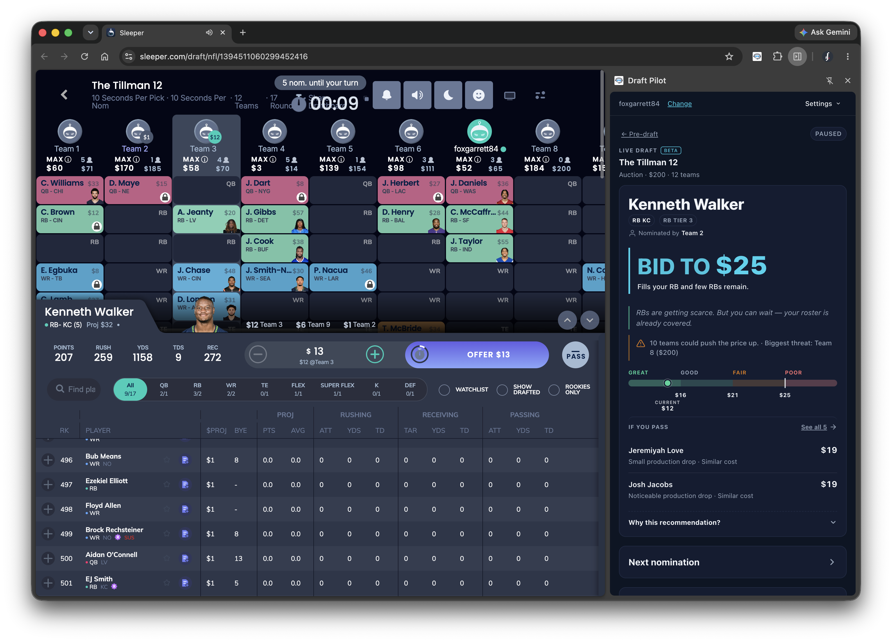

<p align="center">
  
  
</p>

<h1 align="center">Draft Pilot</h1>

<p align="center">
  <b>A free browser extension that coaches you through your Sleeper Fantasy Football draft — in real time.</b>
</p>

<p align="center">
  <a href="#install">Install</a> ·
  <a href="#what-it-does">Features</a> ·
  <a href="#faq">FAQ</a> ·
  <a href="#feedback">Feedback</a>
</p>

<p align="center">
  
  
  
  
</p>

<p align="center">
  
</p>

---

## Quick start

> **Draft Pilot** is a free browser extension for [Sleeper](https://sleeper.com) auction leagues.
> It answers **"what's the most I should pay for this player, right now?"** — every nomination, in real time.

**👉 [Install in 5 minutes ↓](#install)**

---

## 🚧 This is a beta — and I want your feedback

Draft Pilot is a personal project I built for the 2025 season. It works well
enough that I wanted to share it, but it's **not on the Chrome or Firefox
stores yet** — you install it directly from this repo (5 minutes, one time).

**If you use it, please tell me what worked, what broke, and what would make
next season's version better.** File a [GitHub issue](../../issues) or drop me
a note. This is a one-person project and every piece of feedback shapes v0.4.

---

## What it does

Draft Pilot opens as a side panel inside your Sleeper draft room. It does
three things:

### 1. 🎯 Live Auction Coaching *(the main event)*
For every nominated player, you get:
- **Your Max Bid** — the most you should pay, based on *your* roster, *your*
  remaining budget, opportunity cost, positional scarcity, and the current
  auction pace. Different from the player's market Fair Value — this is
  personalized to you.
- **BUY / CAUTION / PASS** verdict against the current bid.
- **Fair Value range** (e.g. `$34–41`) derived from what similar players have
  actually gone for in your league's past drafts — not a made-up ±$X band.
- **Next Nomination strategy** — should you DRAIN opponents' budgets on a
  player you don't want, DISTRACT bidders from your real targets, TARGET a
  fit right now, or WAIT?
- **Available Players market** — searchable, filterable live list showing
  live value, market ± vs baseline, and roster fit.

### 2. 📊 Draft-Room CSV Export
One click exports the current draft room's top ~500 players with projections,
stats, ADP, auction values, and (for auction drafts) a **League-Adjusted
Value** column that re-prices Sleeper's projections to what your league
actually pays.

### 3. 📚 Past-Drafts Export
Load any past draft's full pick history (drafter, price, keeper flag, etc.)
to a CSV — great for hand-off to ChatGPT/Claude for smarter predictions, or
for spreadsheet nerds who want to build their own models.

---

## See it in action

<p align="center">
  
</p>

Want to see a specific feature demo'd next?
[Tell me in Discussions](../../discussions).

---

## Install

> ⏱️ Takes about 5 minutes. No account, no signup, no payment.

### Step 1 — Download the extension

**👉 [Download the latest release (ZIP)](https://github.com/foxgarrett/draftpilot/releases/latest)** — grab `draft-pilot-vX.Y.Z.zip` from the Assets section and unzip it somewhere you'll remember.

<details>
<summary><i>Prefer git? (for contributors / auto-updates via <code>git pull</code>)</i></summary>

```bash
git clone https://github.com/foxgarrett/draftpilot.git
```

</details>

### Step 2 — Load it in your browser

<details open>
<summary><b>Chrome, Edge, Brave, Arc, or any Chromium browser</b></summary>

1. Go to `chrome://extensions` (or `edge://extensions`, `brave://extensions`).
2. Toggle **Developer mode** on (top-right).
3. Click **Load unpacked** and select the `draftpilot/` folder you just
   downloaded.
4. Pin the Draft Pilot icon to your toolbar so you can find it easily.

</details>

<details>
<summary><b>Firefox</b></summary>

1. Go to `about:debugging#/runtime/this-firefox`.
2. Click **Load Temporary Add-on…**.
3. Pick the `manifest.json` file inside the `draftpilot/` folder.
4. ⚠️ Firefox removes temporary add-ons on browser restart. You'll need to
   re-load it before each draft session.

</details>

### Step 3 — Use it
1. Open your Sleeper draft (works pre-draft, during, and after).
2. Click the Draft Pilot toolbar icon — a side panel opens.
3. For CSV export: click **Export Draft Room**.
4. For live coaching during an auction: click **Enter Live Draft Mode**.

---

## FAQ

<details>
<summary><b>Is this safe? What does it access?</b></summary>

Yes. Draft Pilot only runs on Sleeper draft URLs and only talks to Sleeper's
own public API. It stores your synced draft data in your browser's local
storage — nothing is uploaded, sold, or sent to any third party. See the
[full privacy policy](docs/privacy.html) and the source code (all
client-side JavaScript, no build step, easy to audit).

</details>

<details>
<summary><b>Do I need a Sleeper account? A Draft Pilot account?</b></summary>

You need a Sleeper account (obviously). You do **not** need a Draft Pilot
account. There is no account. There is no login. There is no payment.

</details>

<details>
<summary><b>Does it work for snake drafts? Dynasty? Superflex? Keeper?</b></summary>

- **CSV export**: works for every draft format Sleeper supports (snake,
  auction, dynasty, keeper, best-ball).
- **Live auction coaching**: auction drafts only — that's what the bid engine
  is designed for. Snake and dynasty support may come in a future version.

</details>

<details>
<summary><b>Will it auto-bid for me?</b></summary>

No. Draft Pilot is a **coach**, not a bot. It tells you what it thinks you
should do; you still click the buttons.

</details>

<details>
<summary><b>Does it work on mobile?</b></summary>

Not today. Draft Pilot is a desktop browser extension — Chrome/Edge/Brave/Arc
or Firefox on Mac, Windows, or Linux. Sleeper's mobile app doesn't support
extensions. If you draft on mobile, a common workflow is to keep a laptop
open next to you with Draft Pilot for coaching, and bid on your phone.

</details>

<details>
<summary><b>How does "Your Max Bid" actually work?</b></summary>

It's a roster-aware model that reasons across: your open roster slots, your
remaining budget, required future spend (you have to fill every slot),
positional scarcity in the remaining pool, replacement-level depth,
competition from opposing teams' needs and budgets, and a hard budget
legality clamp. Historical league-specific pricing from past drafts feeds
the Fair Value range. All open-source — see
[`utils/bidEngine.js`](utils/bidEngine.js) and
[ARCHITECTURE.md](ARCHITECTURE.md) for the full model.

</details>

<details>
<summary><b>Why isn't this on the Chrome Web Store or Firefox Add-ons?</b></summary>

Store submission takes time and I'd rather ship the next version with your
feedback baked in. For the 2026 season, GitHub install is the plan. The
**v0.4 release — targeting the 2027 draft season — will be built with your
feedback** and is the version I'd like to submit to the stores.

</details>

<details>
<summary><b>Something broke. What do I do?</b></summary>

Open the browser DevTools console (right-click the side panel → Inspect →
Console) and grab any red error text. Then [open an issue](../../issues)
with:
- What you were doing (draft type, roster settings if relevant)
- What you expected
- What happened
- The console error text
- A screenshot if it's a visual bug

Even short reports help a lot.

</details>

<details>
<summary><b>Will this update automatically?</b></summary>

No — unpacked extensions don't auto-update. To get a new version, `git pull`
in the folder (or re-download the ZIP) and click the reload icon on the
extension in `chrome://extensions`.

</details>

---

## Feedback & community

**Draft Pilot is a beta and your feedback is what makes v0.4 (2027 season)
better.** No note is too small — bugs, confusing labels, missing features,
"this UI element is ugly", "the recommendation was wrong for X reason", all
of it.

- 🐛 **Bugs & feature requests** → [open a GitHub issue](../../issues)
- 💬 **Questions, strategy talk, general feedback** → [start a Discussion](../../discussions)
- 👋 **Just want to say hi or share your league story** → also [Discussions](../../discussions) — I read everything

### What's especially helpful to hear about
- League format details (teams, budget, roster slots) when a recommendation felt off
- Sleeper draft URLs where the parser failed (I'll investigate; no login data is shared)
- "I wanted X and couldn't find it" — pure UX friction
- What you'd want the *next* version to do

---

## Support the project

Draft Pilot is free and always will be. If it helped you draft a better team,
here are no-cost ways to help back:

- ⭐ **Star this repo** — signal boost matters more than you'd think
- 📣 **Share it** in your league chat / on r/fantasyfootball / with a friend
- 🐛 **File one piece of feedback** during or after your draft — even one line
- 🔧 **Contribute code** — bug fixes and small features welcome (see [ARCHITECTURE.md](ARCHITECTURE.md))

---

## Privacy & data

- No account, no login, no telemetry.
- All data stays in your browser (`chrome.storage.local`).
- The only network calls are to Sleeper's public API (`api.sleeper.app`) and
  to a static feature-flag JSON hosted on GitHub Pages.
- Full details: [docs/privacy.html](docs/privacy.html).

---

## For developers

The full architecture — the bid engine, scarcity model, parser, live
observer, feature flags, the whole thing — is documented in
[**ARCHITECTURE.md**](ARCHITECTURE.md). If you want to contribute, tinker,
or just understand what it's doing under the hood, start there.

Tests:
```bash
node --test test/*.test.js
```

---

<p align="center"><i>Built by <a href="https://github.com/foxgarrett">Garrett Fox</a>. Not affiliated with Sleeper.</i></p>
